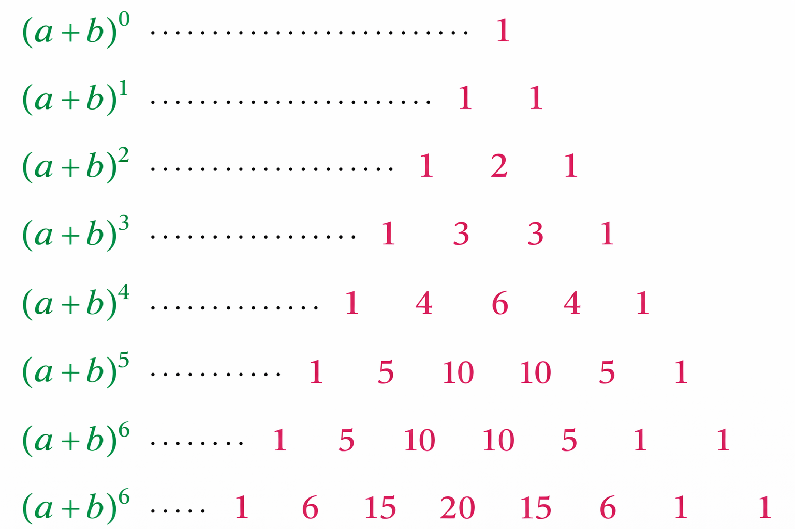

# B册选修2笔记

## 排列、组合与二项式定理

### 分类加法和分步乘法的区别

| 名称 | 定义 | 适用范围 |
| :---: | :---: | :---: |
| 分类加法计数原理 | 用于计算**互不重叠**的事件或类别的总方法数字 | 适用于多个**互斥选择**，每个选择之间没有交集，选择每一个类别时都不影响其他类别 |
| 分步乘法计数原理 | 用于计算一个任务被**分解为多个步骤**的总方法数 | 适用于**多个独立步骤**，每个步骤的选择与其他步骤无关且独立完成 |

### 排列与组合

从 n 个不同对象中取出 m 个对象进行排列的方式称为从 n 个不同对象中取出 k 个对象的**排列**，记作 $A_{n}^{k}$，其计算公式为：

$$
A_{n}^{k} = \frac{n!}{(n-k)!}
$$

从 n 个不同对象中取出 k 个对象进行组合的方式称为从 n 个不同对象中取出 k 个对象的**组合**，记作 $C_{n}^{k}$，其计算公式为：

$$
C_{n}^{k} = \frac{n!}{k!(n-k)!}
$$

其中

$$
C_{n}^{k} = \frac{A_{n}^{k}}{A_{k}^{k}} = \frac{A_{n}^{k}}{k!}
$$

排列与组合的区别与联系

| 区别 | 联系 |
| :---: | :---: |
| 排列考虑顺序，组合不考虑顺序 | $C_{n}^{k} = \frac{A_{n}^{k}}{k!}$ |

### 二项式定理与杨辉三角

二项式定理的定义

$$
(a+b)^n = C_{n}^{0}a^n b^{0} + C_{n}^{1}a^{n-1} b^{1} + C_{n}^{2}a^{n-2} b^{2} + ... + C_{n}^{n}a^{0} b^{n} = \sum_{k=0}^{n} C_{n}^{k}a^{n-k} b^{k}
$$

其中

- 等式右边的式子称为 $(a+b)^n$ 的**展开式**
- $C_{n}^{k}$ 称为第 $k+1$ 项的**二项式系数**，表示从 $n$ 个元素中选取 $k$ 个元素的组合数
- $T_{k+1} = C_{n}^{k}a^{n-k} b^{k}$ 称为二项展开式的**通项公式**

二项式系数之和

$$C_{n}^{0} + C_{n}^{1} + C_{n}^{2} + ... + C_{n}^{n} = (1+1)^n = 2^n$$

即 二项式系数之和等于 $2^n$, 二项式系数的偶数项和与奇数项和相等，均为 $2^{n-1}$。

杨辉三角的定义 : 杨辉三角是一种排列二项式系数的三角形结构，每一行对应一个二项式展开式的系数。

杨辉三角的性质

- 每一行都是对称的，且两端的数字均为1
- 从第三行开始，不在两端的每个数字都等于上一行中与这个数字相邻的两个数字之和
- 二项式系数满足中间大，两边小的规律
  - 当 n 为偶数时，二项式系数在中间处取得最大值
  - 当 n 为奇数时，二项式系数在中间的两个位置取得最大值

## 概率与统计

### 条件概率

当事件 B 发生的概率大于 0 时，事件 A 在事件 B 已经发生的条件下发生的概率，称为 A 在 B 条件下的条件概率，记作 $P(A|B)$，其计算公式为：

$$
P(A|B) = \frac{P(A \cap B)}{P(B)} = \frac{P(AB)}{P(B)} \quad (P(B) > 0)
$$

条件概率的性质

- $0 \leq P(A|B) \leq 1$ 说明条件概率的取值范围为 0 到 1 之间
- $P(A|A) = 1$ 说明在事件 A 已经发生的条件下，事件 A 发生的概率为 1
- $B \cap C = \emptyset, P((B \cup C) | A) = P(B|A) + P(C|A)$ 条件概率加法规则

### 乘法公式与全概率公式

根据事件 A 发生的概率，以及已知事件 A 发生时事件 B 发生的条件概率，可以计算事件 A 和事件 B 同时发生的概率，称为事件 A 和事件 B 的联合概率，记作 $P(A \cap B)$ 或 $P(AB)$，其计算公式为：

$$
P(AB) = P(A) \cdot P(B|A) = P(B) \cdot P(A|B)
$$

联合概率的乘法法则

对于 n 个事件 $A_1, A_2, ..., A_n$，它们的联合概率可以表示为：

$$
P(A_1 \cap A_2 \cap ... \cap A_n) = P(A_1) \cdot P(A_2|A_1) \cdot P(A_3|A_1 \cap A_2) \cdot ... \cdot P(A_n|A_1 \cap A_2 \cap ... \cap A_{n-1})
$$

TODO P48 全概率公式 P50 全概率公式和直观解释

TODO P51 贝叶斯公式 P53 贝叶斯公式推论

### 独立性与条件概率的关系

TODO P56 A 与 B 独立的充要条件

### 随机变量及其与事件的关系

TODO P61 随机变量的定义

TODO P62 随机变量的性质

TODO P63 随机变量的关系

### 离散型随机变量的分布列

TODO P66 离散型随机变量的分布列

TODO P67 离散型随机变量的分布列的性质

TODO P68 离散型随机变量函数的性质

TODO P69 两点分布

### 二项分布与超几何分布

二项分布

一般地，如果一次伯努利试验中，出现“成功”的概率为 p ,记 q = 1-p, 且 n 次独立重复实验中出现“成功”的次数为 X , 则 X 的取值范围是

$$
{0, 1, 2, ..., n}
$$

而且

$$
P(X = k) = C_{n}^{k}p^{k}q^{n-k}, k = 0, 1, 2, ..., n
$$

因此 X 的分布列如下表所示

| X | 0 | 1 | 2 | ... | k | n |
| :---: | :---: | :---: | :---: | :---: | :---: | :---: |
| P | $C_{n}^{0}p^{0}q^{n}$ | $C_{n}^{1}p^{1}q^{n-1}$ | $C_{n}^{2}p^{2}q^{n-2}$ | ... | $C_{n}^{k}p^{k}q^{n-k}$ | $C_{n}^{n}p^{n}q^{0}$ |

上述 X 的分布列第二行中的概率值都是二项展开式

$$
(q+p)^{n} = \sum_{k=0}^{n}C_{n}^{k}p^{k}q^{n-k}
$$

中对应项的值，因此称 X 服从参数为 n, p 的二项分布，记作

$$
X \sim B(n, p)
$$

----

超几何分布

一般地，若有总数为 N 的甲、乙两类物品，其中甲类有 M 件，从所有物品中随机取出 n 件，则这 n 件中所含甲类物品数 X 是一个离散型随机变量

$$
P(X = k) = \frac{C_{M}^{k}C_{N-M}^{n-k}}{C_{N}^{n}}
$$

这里的 X 称为服从参数为 N, n, M 的超几何分布，记作

$$
X \sim H(N, n, M)
$$

### 随机变量的数字特征

TODO P81 期望

一般地，如果离散型随机变量 X 的分布列如下表所示

| X | $x_1$ | $x_2$ | $x_3$ | ... | $x_n$ |
| :---: | :---: | :---: | :---: | :---: | :---: |
| P | $p_1$ | $p_2$ | $p_3$ | ... | $p_n$ |

那么 X 的期望为

$$
E(X) = \sum_{i=1}^{n}x_ip_i
$$

若 X 服从参数为 n, p 的二项分布，即X~B(n, p)，那么 X 的期望为

$$
E(X) = np
$$

若 X 服从参数为 N, n, M 的超几何分布，即X~H(N, n, M),那么 X 的期望为

$$
E(X) = \frac{nM}{N}
$$

若 X 与 Y 都是随机变量，且 Y = aX + b，那么 Y 的期望为

$$
E(Y) = aE(X) + b
$$
